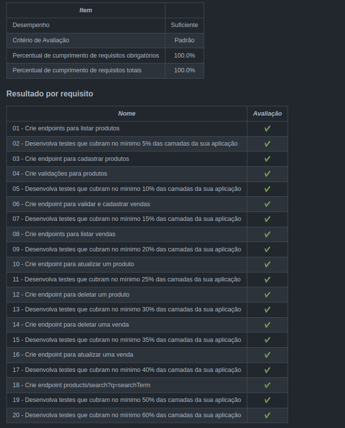

<h1>Sobre</h1>

Quinto projeto do módulo 3 - Back-end, da <a href="https://betrybe.com" target="_blank">Trybe!</a>

Dessa vez foi o projeto Store Manager. O desafio foi construir uma API utilizando o modelo MSC (model, service, controller) e realizar pelo menos 60% de de cobertura testes de cada camada. 

<h1>Instalando</h1>

Para instalar, basta executar o comando <code>npm install</code> no diretório raiz do projeto.

Logo depois, rode o comando <code>docker-compose up</code>, também, no diretório raiz do projeto. 

Por fim, execute o comando <code>npm start</code>

<h1>Tecnologias utilizadas</h1>

<ul>
  <li>Node.js</li>
  <li>Express</li>
  <li>MySQL</li>
  <li>docker</li>
  <li>mocha</li>
  <li>sinon</li>
  <li>chai</li>
</ul>

<h1>Nota</h1>

 